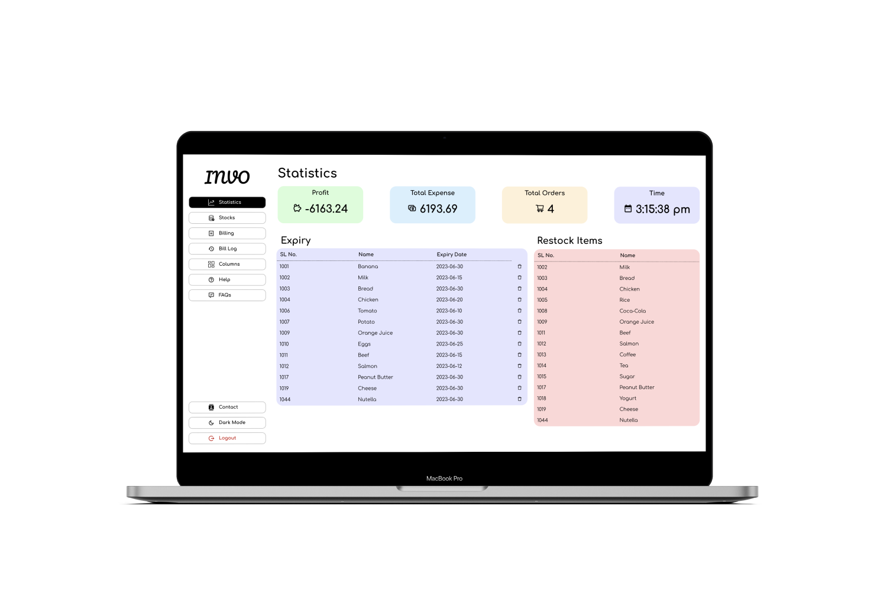
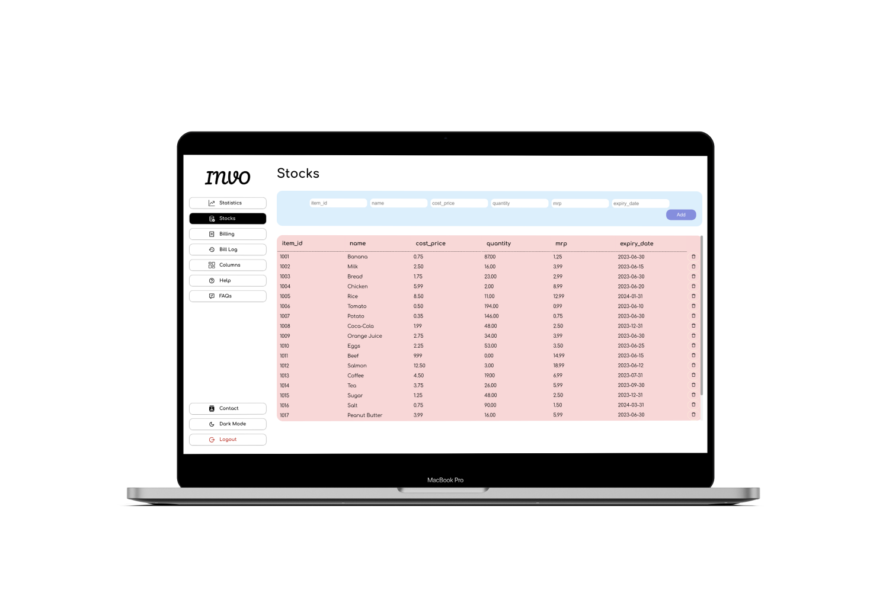
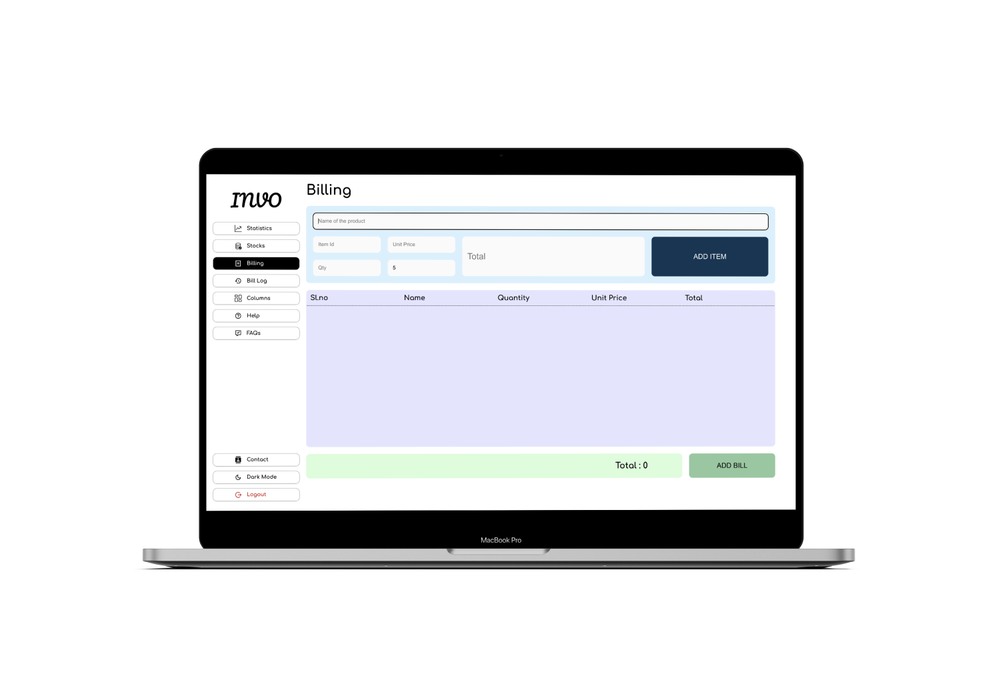
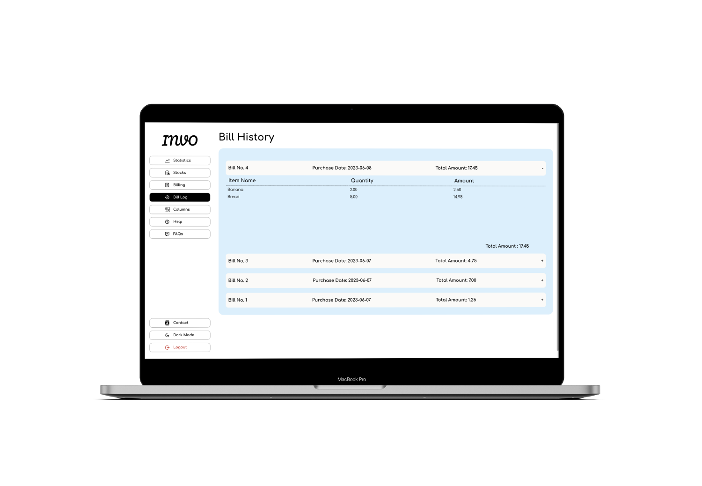
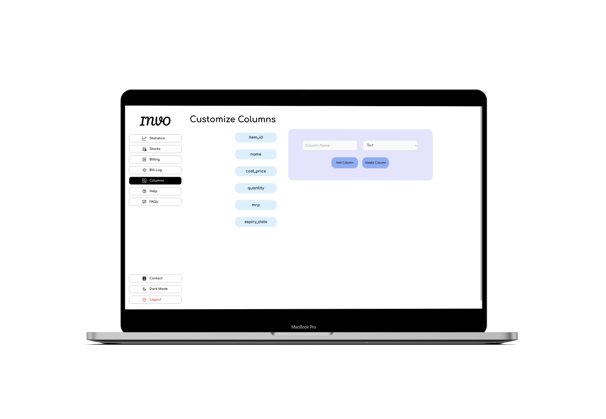
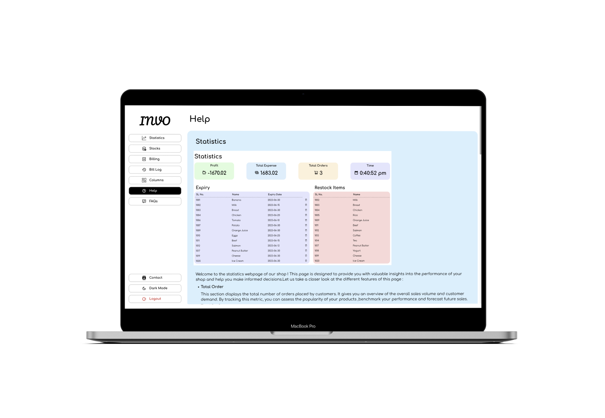
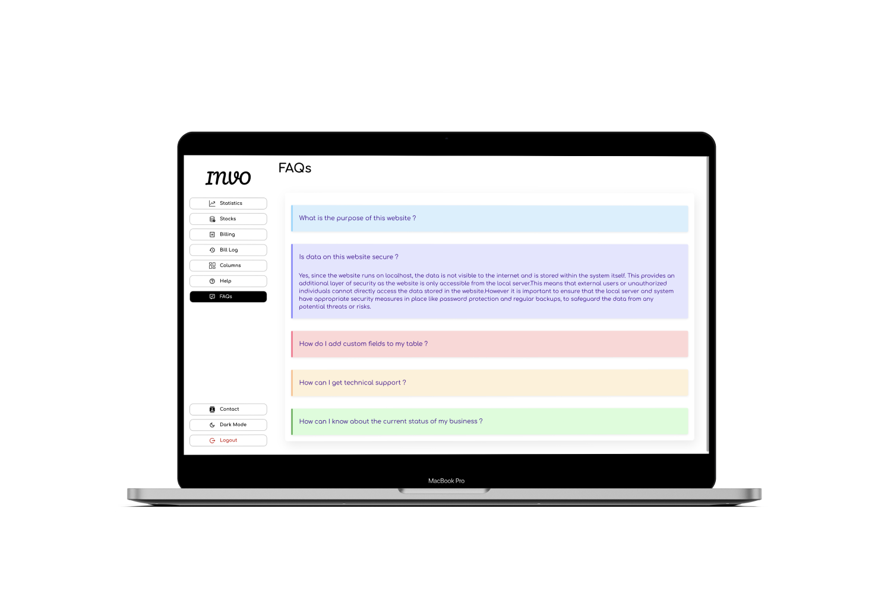
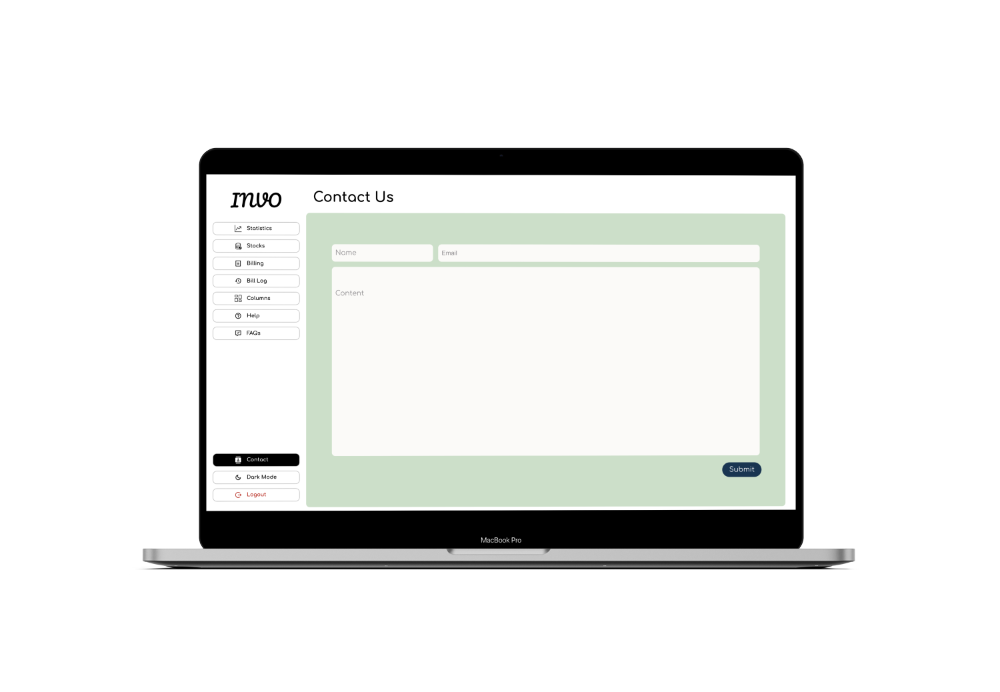
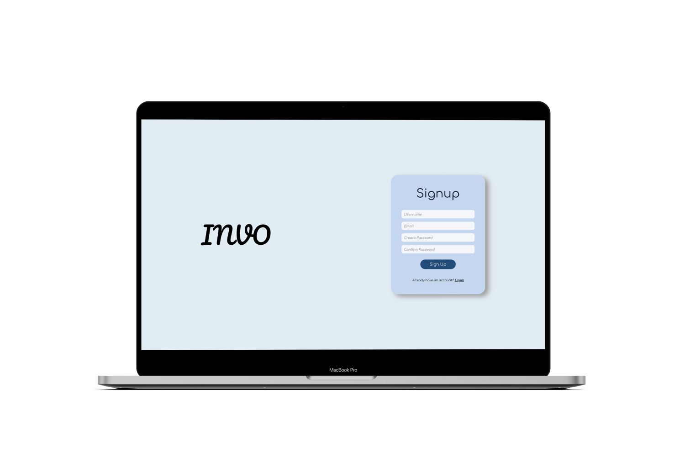

# Invoice Management System

This web-based application is designed to assist shopkeepers in efficiently managing their inventory and invoices. The system provides an easy-to-use interface for generating, managing, and tracking invoices, while also offering data analytics to help shopkeepers make informed decisions about their business operations.

## Purpose
The purpose of this application is to ease data management and create a convenient and user-friendly tool for shopkeepers to manage their data and stocks efficiently. The system is based on a relational database with stock management and analytics functions. It aims to simplify daily operations for shopkeepers and empower them to make data-driven decisions to grow their business.

## Audience
This project is a prototype for the Invoice Management System and is restricted within the college premises. It has been implemented under the guidance of college professors and is primarily useful for small and medium-sized enterprises.

## Project Scope
The Invoice Management System is a web-based application that allows shopkeepers to manage their inventory and invoices. It includes the following key features:

- User authentication
- Data entry
- Data storage
- Data retrieval
- Reporting

The system operates in a web browser environment and is designed to cater to the needs of small to medium-scale shopkeepers.

## System Features
### 1. Table Creation and Customization
Users can create tables to store and organize their data. They have the flexibility to customize attributes based on their specific requirements.

### 2. Billing Creation and Management
The application enables users to create bills by providing necessary information such as product details and other relevant information. Users can add, delete, and search for bills, facilitating effective management of invoices.

### 3. Insights and Analytics
The system provides users with analytics features to track the financial performance of their business. This includes information on the total orders made, profits gained, and total purchases.

## Operating Environment
The Invoice Management System operates in the following environment:

- Distributed database
- Client/server system
- Operating system: All systems
- Database: MySQL
- Platform: Node.js

## Design and Implementation Constraints
The users of the system are primarily engaged in the following activities:

- Login: Users must provide a username and password to access the system, ensuring security.
- Table Creation and Modification: Users can create stock tables with custom fields and enter data. They can also alter the table by adding or removing fields.
- Billing: Users can search for items, add them to the bill, and calculate the total amount for each bill.
- Technical Support: Users have access to a form for inquiries and can contact the developers for technical support.

The constraints of the Invoice Management System include scalability, data input, the ability to handle multiple attributes, and a user-friendly interface.

## Mockups
Please find below the mockups of the user interface:

1. 
2. 
3. 
3. 
3. 
3. 
3. 
3. 
3. 
3. 
3. 

## Contact
For any technical support or inquiries, please contact:
- [INVO](mailto:nikhitkumar00@gmail.com)

We are here to assist you and enhance your experience with the Invoice Management System.
